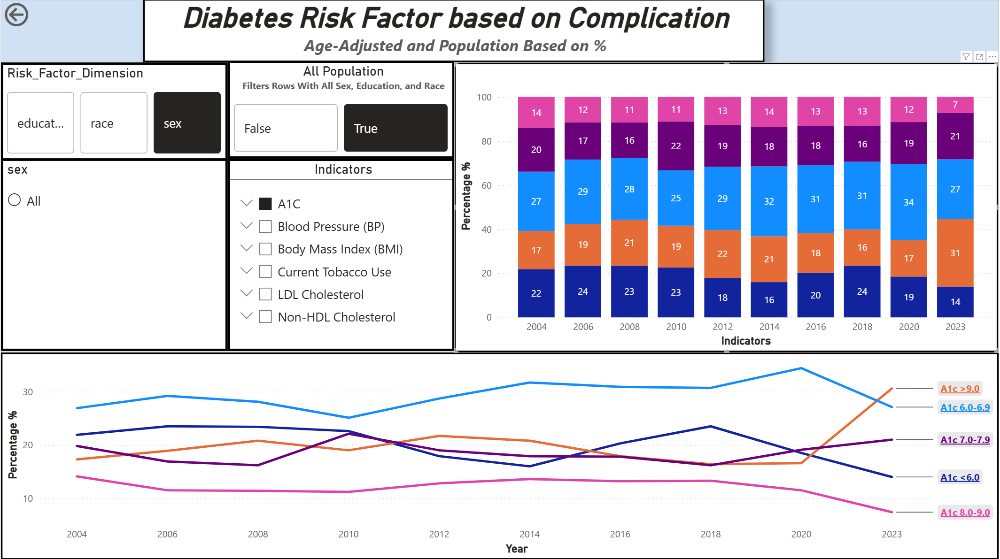

# Diabetes Indicator Report

---
1. Where did I get this data?
    - This data is based off of the CDC United States Diabetes Surveillance System. Which tracks information regrading Diabetes in the US population at national, state, and county levels. 
    In this report I will analyze the USDSS National Other Diabetes Indicator API data, to find trends and findings. 
    - This data contains all types of diabetes. 
2. What is Diabetes?:
    - To understand what the data means we first need to understand the basics. **Diabetes is a disease that occurs when your blood sugar(glucose) is too high**. Glucose is your body's main source of energy. Your body makes glucose(sugar), but glucose(sugar) also comes from foods we eat. 
    - Insulin is a hormone made by the pancreas that helps glucose get into your cells to be used for energy. **If you have Diabetes, your body doesn't make enough - or any - insulin**, the glucose will just stay in your blood and not reach the cells. 
## Analysis

---
### Diabetes Risk Factor for Complication? 

---
What group of adults 18+ with diabetes for each risk factors (Blood Sugar(A1), Body Mass Index (BMI), Blood Pressure(BP), LDL Cholestrol, Non-HDL Cholestrol, and Tabacco Use)?

#### **Blood Sugar (A1C)**

***
- Before we dive into the Analysis, lets first answer what A1C is? A1C is a blood test that provides information about your averaage levels of blood glucose, also called bloos sugar, over the past 3 months. It can be used to diagnose type 2 diabetes and prediabetics. **A Normal A1C level is below 5.7**.

|**Diagnosis**| **A1C Level**|
|-------------|------------|
|Normal| below 5.7%|
|Prediabetics| 5.7 to 6.4 %|
|Diabetes| 6.5 percent or above|

1. **2004(I am going to refer Adults 18+ with diabetes as AWD)**: 
    1. Notice how AWD with "A1C <6.0" were significantly higher in the early 2000s compare to 2023. Why is that? Doesn't low blood sugar mean you don't have diabetes? Lets answer it:
    2. A1C tests can be affected by various things, such as:
        - Genetics
        - Medical conditions
        - Medications and supplements(**Most likely the case**).
        - Errors in the collextion, transport, or processing of the test. 
    3. I am leaning towards **Diabetic Medications** being the reason for AWD with A1C < 6.0 having diabetes. Since the blood sugar level is low, but the process of generating insulin is still affected from the previous high blood sugar. 
    4. **This is actually good news**, diabetes was treated seriously in the past, AWD with A1C > 9.0, A1C 8.0-9.0, and A1C 7.0-7.9 were at a all time low.  
2. **2006 - 2020**
    1. You will notice how AWD with "A1C <6.0 is gradaully doing down, while "A1C > 9.0" and "A1C 7.0-7.9" still remains the same. But **AWD with *"A1C 6.0-6.9" increase drastically after 2010**. This is a pretty alarming sign to whats to come. 
3. **2020-2023**
    1. There is a huge upward spike for AWD with "A1C > 9.0" and a huge downward spike for AWD "A1C < 6.0". Why is that?
    2. Diabetes is caused by lack of exercise, bad diet, or stress. What was happening in this time period?
    3. At the end of 2020 the Covid pandemic started, which resulted mass lockdownn. This could result in people not going outside to exercise or goto gyms which encourges people to not moving, having bad diets can amplify having high blood sugar, and it is was also stressful times. 
***