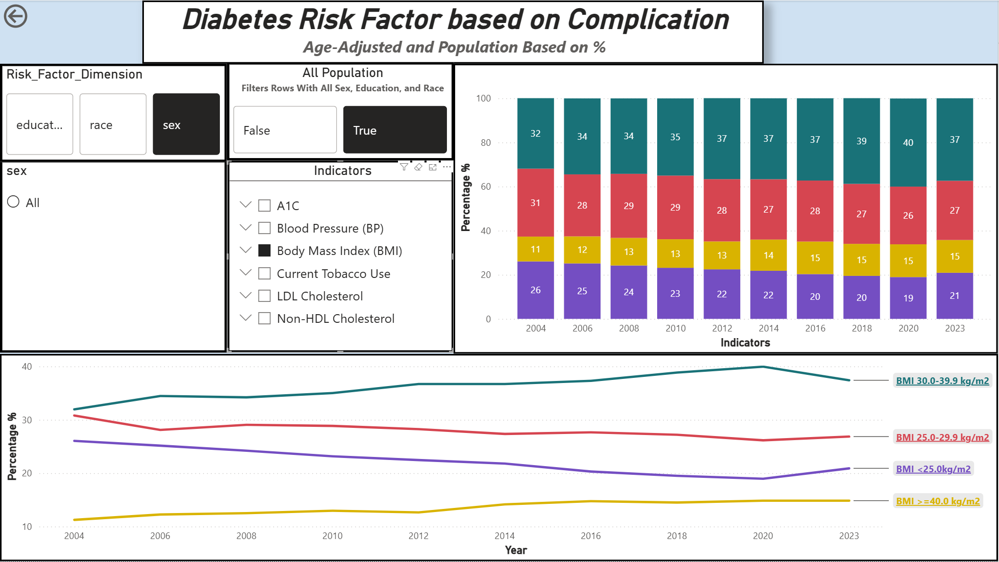
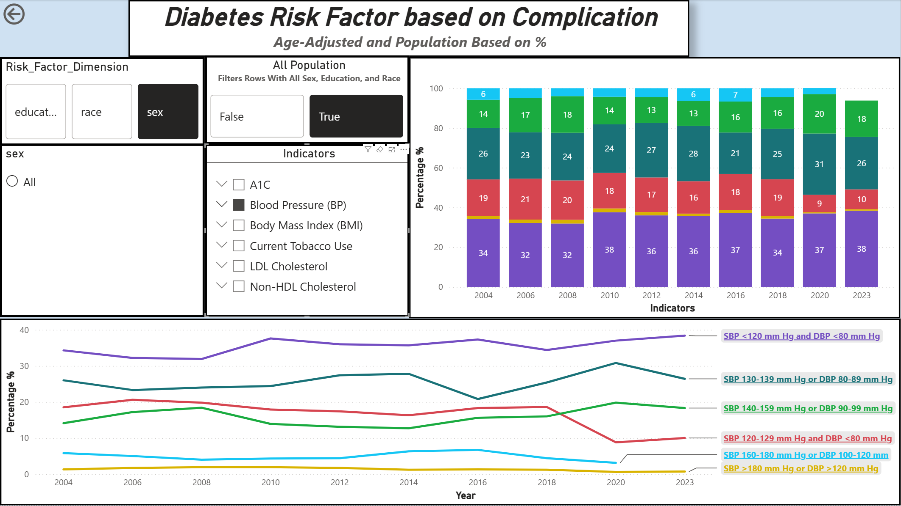

# Diabetes Indicator Report

---
1. Where did I get this data?
    - This data is based off of the CDC United States Diabetes Surveillance System. Which tracks information regrading Diabetes in the US population at national, state, and county levels. 
    In this report I will analyze the USDSS National Other Diabetes Indicator API data, to find trends and findings. 
    - This data contains all types of diabetes. 
2. What is Diabetes?:
    - To understand what the data means we first need to understand the basics. **Diabetes is a disease that occurs when your blood sugar(glucose) is too high**. Glucose is your body's main source of energy. Your body makes glucose(sugar), but glucose(sugar) also comes from foods we eat. 
    - Insulin is a hormone made by the pancreas that helps glucose get into your cells to be used for energy. **If you have Diabetes, your body doesn't make enough - or any - insulin**, the glucose will just stay in your blood and not reach the cells. 
## Analysis

---
### Diabetes Risk Factor for Complication? 

---
What group of adults 18+ with diabetes for each risk factors (Blood Sugar(A1), Body Mass Index (BMI), Blood Pressure(BP), LDL Cholestrol, Non-HDL Cholestrol, and Tabacco Use)?

#### Blood Sugar (A1C)

***
- Before we dive into the Analysis, lets first answer what A1C is? A1C is a blood test that provides information about your averaage levels of blood glucose, also called bloos sugar, over the past 3 months. It can be used to diagnose type 2 diabetes and prediabetics. **A Normal A1C level is below 5.7**.

|**Diagnosis**| **A1C Level**|
|-------------|------------|
|Normal| below 5.7%|
|Prediabetics| 5.7 to 6.4 %|
|Diabetes| 6.5 percent or above|

1. **2004(I am going to refer Adults 18+ with diabetes as AWD)**: 
    1. Notice how AWD with "A1C <6.0" were significantly higher in the early 2000s compare to 2023:
    2. This trend shows that people with Diabetes were getting treated for their type 2 and type diabetes, by keeping their blood sugar level in check. This is a good thing
2. **2006 - 2020**
    1. You will notice how AWD with "A1C <6.0 is gradaully doing down, while "A1C > 9.0" and "A1C 7.0-7.9" still remains the same. But **AWD with *"A1C 6.0-6.9" increase drastically after 2010**. This is a pretty alarming sign to whats to come. 
3. **2020-2023**
    1. There is a huge upward spike for AWD with "A1C > 9.0" and a huge downward spike for AWD "A1C < 6.0". Why is that?
    2. Diabetes is caused by lack of exercise, bad diet, or stress. What was happening in this time period?
    3. At the end of 2020 the Covid pandemic started, which resulted mass lockdownn. This could result in people not going outside to exercise or goto gyms which encourges people to not to move alot, having bad diets can amplify having high blood sugar, and it is was also stressful times. 
- **Keynote: To summarize. Diabetes was being treated properly in 2004 keeping diabetic adults blood sugar level low, but in 2023 blood sugar level is at a all time high**
***

#### Body Mass Index(BMI)
***

- What is BMI? It is a measure to calculate the measure of weight relative to height
- Why does BMI matter? If you have a BMI > 30 you are considered obese, having fat can cause you to have insulin resistence, due to you pancreas being wearing out by keeping blood sugar levels in range. 
|Status|BMI|
|------|---|
|Underweight| < 18.5|
|Optimal| 18.5 - 24.9|
|Overweight| 25 - 29.9|
|Class 1 Obesity| 30 - 34.9|
|Class 2 Obesity| 35 to 39.9|
|Class 3 Obesity | 40 >|

1. **2004 - 2023**
    1. As we can see from the the trend. **Obesity and overweight were both high in 2004 and 2023 respectively, But obesity still increasing from 2004 to 2023**. 
    2. American is know for its obesity, due to americans reliance on Ultra-processed food packed with added sugars, sodium, calories, and unhealthy fats. 

***

#### Blood Pressure(BP)
***

- What is it? Blood Pressure is the force exerted by circulating blood agains the walls of the arteries
- How does it correlates with diabetes? High Blood Sugar > Wears Down Artries(where blood travels) -> making it harder for flood to flow. Think of it as pinching a water hose
- What can happen? High blood pressure can lead to risks of a Stroke and Heart Attack

|Levels|SBP|
|------|---|
|Normal| < 120 mm|
|Elevated| 120-129 mm|
|Stage 1 High BP| 130 - 139|
|Stage 2 High BP| 140 >|
|Severe High BP| 180 >|
|High BP Emergency| 180 >|

1. From the consistent trend from 2004-2023 we can see that, 30-39% of AWD have normal Blood Pressure, But about 40-50% of AWD have Stage 1 High Blood Pressure.
***