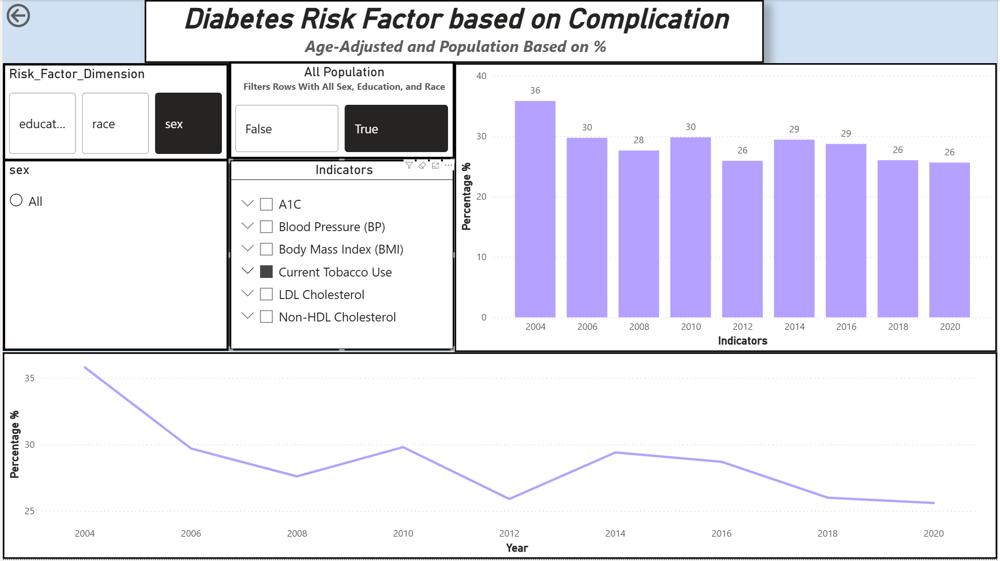
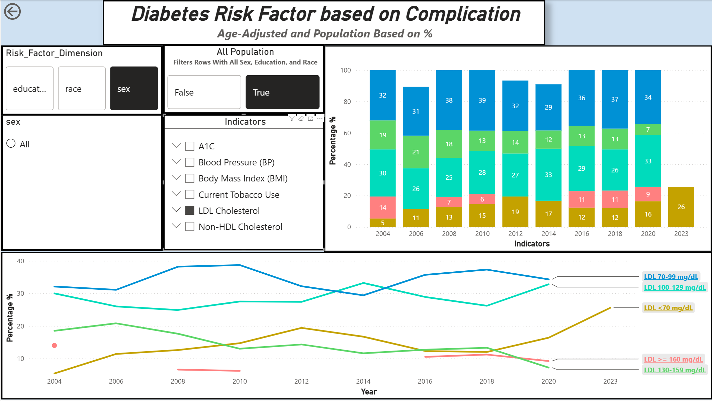
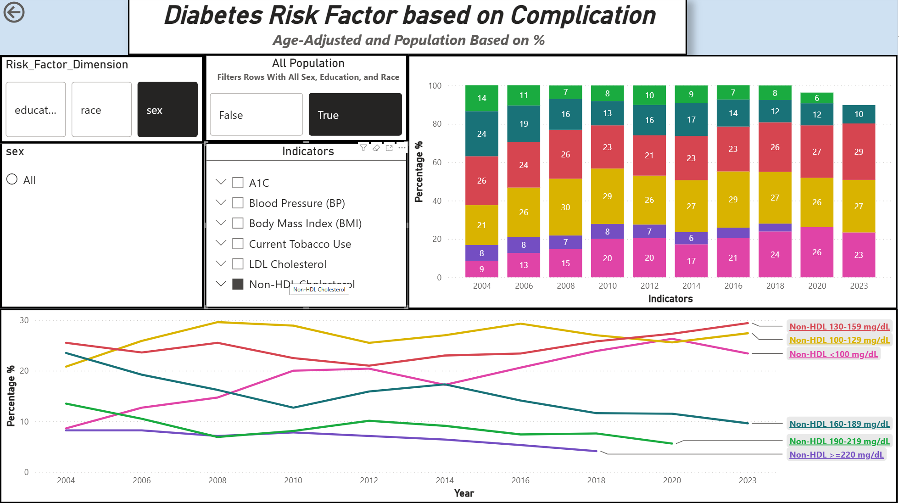

# Diabetes Indicator Report

---
1. Where did I get this data?
    - This data is based off of the CDC United States Diabetes Surveillance System. Which tracks information regrading Diabetes in the US population at national, state, and county levels. 
    In this report I will analyze the USDSS National Other Diabetes Indicator API data, to find trends and findings. 
    - This data contains all types of diabetes. 
2. What is Diabetes?:
    - To understand what the data means we first need to understand the basics. **Diabetes is a disease that occurs when your blood sugar(glucose) is too high**. Glucose is your body's main source of energy. Your body makes glucose(sugar), but glucose(sugar) also comes from foods we eat. 
    - Insulin is a hormone made by the pancreas that helps glucose get into your cells to be used for energy. **If you have Diabetes, your body doesn't make enough - or any - insulin**, the glucose will just stay in your blood and not reach the cells. 
3. Citation:
    Cleveland Clinic: https://my.clevelandclinic.org/health/diseases/7104-diabetes
# Analysis
---
# Diabetes Risk Factor for Complication? 
---
What group of **Adults 18+ with Diabetes(AWD)** for each risk factors (Blood Sugar(A1), Body Mass Index (BMI), Blood Pressure(BP), LDL Cholestrol, Non-HDL Cholestrol, and Tabacco Use)?

## Blood Sugar (A1C) 
***
### Basic Info:
- Before we dive into the Analysis, lets first answer what A1C is? A1C is a blood test that provides information about your averaage levels of blood glucose, also called bloos sugar, over the past 3 months. It can be used to diagnose type 2 diabetes and prediabetics. **A Normal A1C level is below 5.7**.

|**Diagnosis**| **A1C Level**|
|-------------|------------|
|Normal| below 5.7%|
|Prediabetics| 5.7 to 6.4 %|
|Diabetes| 6.5 percent or above|

### What Happend?

- As we can see from the chart, the Blood Sugar relatvely level was low in diabetic people. But as time went on(especially in 2023) **the Blood Sugar level A1C > 9 in diabetic people soared up high from 17% in 2004 to 31% in 2023 almost doubling** and **the Blood Sugar level A1C < 6.0 almost halved from 22% in 2003 to 14% in 2023**.  

### Why did this happen?
- Though we can't answer this question provided by the USDSS data. We can make some speculations.
    1. The sudden soaring of A1C > 9 from 2004 to 2023, could link to: 
        1. The Covid Pandermic where majority of the population mostly lived indoors and most likely doing many physical activities, such as going to gyms or running outside. Also Covid-19 could possibly cause diabetes according to Sun H et al. 
        2. Dietary shift towards more processed foods with higher calories. 

### Citation:
    1. Kim, Sun H et al. “New-Onset Diabetes After COVID-19.” The Journal of clinical endocrinology and metabolism vol. 108,11 (2023): e1164-e1174. (https://pmc.ncbi.nlm.nih.gov/articles/PMC11009784/)
    2. diabetesfreesc.org "Understanding Your A1C Level and How It Can Help Manage Diabetes" https://www.diabetesfreesc.org/news/understanding-your-a1c-level-and-how-it-can-help-manage-diabetes

***
## Body Mass Index(BMI) 
***
### Basic Info:
- What is BMI? It is a measure to calculate the measure of weight relative to height
- Why does BMI matter? If you have a BMI > 30 you are considered obese, having fat can cause you to have insulin resistence, due to you pancreas being wearing out by keeping blood sugar levels in range. 
|Status|BMI|
|------|---|
|Underweight| < 18.5|
|Optimal| 18.5 - 24.9|
|Overweight| 25 - 29.9|
|Class 1 Obesity| 30 - 34.9|
|Class 2 Obesity| 35 to 39.9|
|Class 3 Obesity | 40 >|

### What happend?
1. **2004 - 2023**
    1. As we can see from the the trend. **Obesity and overweight were both high in 2004 and 2023 respectively. However, obesity continued increasing from 2004 to 2023**. 

### Why did this happen?
1. According to Temple, Norman the obesity epidemic appeared in the USA in 1976-1980.
2. But why did this obesity epidemic started?
    1. Sugar intake:
        1. The Sugar intake was fairly stable in the 1970s but rose sharply after 1978 according to Temple, Norman 3. 
        2. Per Capita intake of total cloric sweetners was 124.6 lbs in 1978, then in 1997 it increated to 154.1 lbs
    2. Dietary Fat:
        1. In 1976-1980 US government recommended Americans to reduce far consumptions, the food industry responded with more low-fat products,
        2. But from 1976-1980 to 1999-2000 show that the percentage of calories from fat decreased slightly, byut total energy intake increased, meaning overall amount of fat consumed likely stayed thge same or even rose slightly 
        3. Temple, Normal 3 reseach shows that these changes in dietary fat intake had little connection to the Obesity pandemic.
    3. **Ultra-Processed Foods (UPF):** 
        1. Foods that are prepared with mostly cheap sources of dietary energy and nutrients plus additives.
        2. Mostly consists of high calories, salt, sugar, and fat but minimal amounts of whole foods. 
        3. They also have low content of dietary fiber, phytochemicals and various micronutrients such as vitamin C, magnesium, and potassium
        4. UPF's food consist of white breads, pizza, candy, ice cream, etc. 
        4. This shows that UPF's played a major role in the Ameican obesity pandemic.
    4. Roles of Farm Bills and Food Prices:
        1. Healthier diets cost significant higher then less healthy diets. International study found that top qunatile cost for healthy food is $1.54 more per 2000 kcal(based on 2011 prices)
        2. Shoppers tend to buy cheaper food. 

### Citation:
1. Temple, Norman J. “The Origins of the Obesity Epidemic in the USA-Lessons for Today.” Nutrients vol. 14,20 4253. 12 Oct. 2022, [doi:10.3390/nu14204253](https://pmc.ncbi.nlm.nih.gov/articles/PMC9611578/)
***

## Blood Pressure(BP) 
***
### Basic Info:
- What is it? Blood Pressure is the force exerted by circulating blood agains the walls of the arteries
- What can happen? High blood pressure can lead to risks of a Stroke and Heart Attack
- High blood pressure(Hypertension) and diabetes are two common metabolic disorders that often coexist in the same individual. Combination of both can lead to risks of Heart Disease and Strokes. 
- High Blood Sugar > Wears Down Artries(where blood travels) -> making it harder for flood to flow. Think of it as pinching a water hose
- Obesity causes changes in the blood vessels, kidneys, and other parts of the body according to MayoClinic
- Tobacco or Smoking can injure the blood vessels walls and speed of hardening of the arteries. 

|Levels|SBP|
|------|---|
|Normal| < 120 mm|
|Elevated| 120-129 mm|
|Stage 1 High BP| 130 - 139|
|Stage 2 High BP| 140 >|
|Severe High BP| 180 >|
|High BP Emergency| 180 >|

### What happend?
1. **2004-2023**
    1. From the consistent trend from 2004-2023 we can see that, 30-39% of AWD have normal Blood Pressure, But about 40-50% of AWD have Stage 1 High Blood Pressure.

### Why does this happen?

### Citation
1. MayoClinic: https://www.mayoclinic.org/diseases-conditions/high-blood-pressure/symptoms-causes/syc-20373410
2. Hezam, Ali Ahmed Mohammed et al. “The connection between hypertension and diabetes and their role in heart and kidney disease development.” Journal of research in medical sciences : the official journal of Isfahan University of Medical Sciences vol. 29 22. 29 Apr. 2024, [doi:10.4103/jrms.jrms_470_23](https://pmc.ncbi.nlm.nih.gov/articles/PMC11162087/)
***

***
## Tabocco Use: 

### Basic Info:
1. What is it? According to National Cancer Institute, it is a plant with leaves that has high levels of a addcitive chemical called Nicotine 

### What happend?
1. **2004-2023**:
    1. As we can see from the dashboard above. The use of Tabacco in diabetic adults **decreased from 35% in 2004 to 24% in 2023**. Why is that

### Why has that happend?
1. According to Cummings, K Micheal, during 1964, smoking was permitted nearly everywhere in the US, you could smoke in bars, restaurants, buses, trains, planes, and even hospitals and school buldings. In 1967 FTC(Federal Trade Commission) reported that it was "impossible for Americans of almost any age to avoid cigarette advertising”.
2. Then Policies and Regulations for tobacco control came by implementing "...smoke-free policies, hiking cigarette taxes, and adopting policies to discourage smoking by young people.". Due to its health risks, addictive nature, and potential to cause fire hazards. 
### Citation
1. Cummings, K Michael. “Smoking Isn't Cool Anymore: The Success and Continuing Challenge of Public Health Efforts to Reduce Smoking.” Journal of public health management and practice : JPHMP vol. 22,1 (2016): 5-8. [doi:10.1097/PHH.0000000000000360](https://pmc.ncbi.nlm.nih.gov/articles/PMC4662068/)
2. Cole, Helene M, and Michael C Fiore. “The war against tobacco: 50 years and counting.” JAMA vol. 311,2 (2014): 131-2. [doi:10.1001/jama.2013.280767](https://pmc.ncbi.nlm.nih.gov/articles/PMC4465196/)
3. National Cancer Institure. "Tabacco". https://www.cancer.gov/publications/dictionaries/cancer-terms/def/tobacco
***

***
## LDL(Low Density Lipoprotein) cholestrol:

### Basic Info:
1. Often referred as to "Bad Cholestrol", which itself isn't bad. It plays and important role in your body, but too much of it is bad. LDL are fat particles and protein that carry fats through your bloodstream.
2. Excess LDL can cause excess plaque build up in your arteries and making it difficult for blood to travel,(Similiarly to High blood pressure). 
3. Levels:
|LDL Level(mg/dl)| Status|
|---------|-------|
|< 100| Normal LDL|
|100-129| Elevated LDL|
|130-159| Borderline High LDL|
|160-189| High LDL|
|190 >| Very High LDL|
4. Anything above 100 mg/dl raises your risks of cardiovascular disease.

### What happend?
1. **2004-2023**:
    1. The data is rather incomplete, but from what we can see is that the rate of **Eleveted LDL** is relatively the same, But there has been a rise of **Normal LDL** Levels From 37% in 2004 to 50% in 2023. 

### Why it happend?
1. According to Capewell, et al. The main reason for low LDL levels is due to Statins. 
2. What is Statins? Statins are drugs that lower LDL in the blood. 
### Citation
1. Cleveland Clinic: https://my.clevelandclinic.org/health/articles/24391-ldl-cholesterol
2. Capewell, Simon, and Earl S Ford. “Why have total cholesterol levels declined in most developed countries?.” BMC public health vol. 11 641. 11 Aug. 2011, [doi:10.1186/1471-2458-11-641](https://pmc.ncbi.nlm.nih.gov/articles/PMC3199603/#sec11)
***

***
## Non-HDL cholesterol:

### Basic Info: 
1. Non-HDL cholestrol refers to all the cholesterol carried on particles other then High Density Lipoproteins (HDL). it captures the amount of "bad" cholesterol in your blood.
2. These particles include. LDL, very-LDL, Intermediate-density lipoproteins, etc. 
3. What causes them? Genetics, Diet(eating foods with trans-fat, saturated fat, and added sugar), Obesity, Using Tobacco, Not getting enough exercise. 

|Non-HDL Levels(mg/dl)| Status|
|---------------------|-------|
|< 130 | Normal|
|130 - 159| Elevated|
|160 > | High 

## What happend?
1. **2004**
    1. The Non-HDL levles were at a all time high **46% of the population had high levels of Non-HDL** and **26% of them had Elevated levels of Non-HDL**. 
2. **2004-2023**
    1. As the time went on **The high levels of Non-HDL decreased drastically from 46% to 10%** and **Normal Levels rose from 30% to 50%** while **Elevated levels stayed about the same only slight increase from 26% to 29%**

## Why has this happend?
1. Non-HDL levels are linked to LDL(Mostly), Obesity, and Tobacco use. From the trends above we can see the LDL and Tobacco uses decresed drastically, while obesity only increased slightly. Hence the drastic decrease of Non-HDL levels. 
## Citation:
Cleveland Clinic: https://my.clevelandclinic.org/health/articles/non-hdl-cholesterol
***

# How can we reduce diabetes?
1. Reducation or Regulations agains UPF(Ultra Processed Food):
    1. Why?: 
        1. UPF currently plays a major role or even the leading cause in the obesity pandemic. 
        2. Obesity causes Non-HDL, high blood sugar, LDL, and High blood pressure. 
        3. UPF food provide minimal nutrients, while pumped so calories, sugar, sodium, and fats. [Jump To this for more information](#upf)
    2. What should we do?
        1. Force manufacturers to reduce the amount of calories, sugar, sodium, and fats that can be added to the food propotion to its portions and add more nutrients. 
        2. Make healthy alternatives cheaper. 
        3. Educate the general population about the harms to eating UPF, [similar to what they did to smoking](#tabacco). 
---